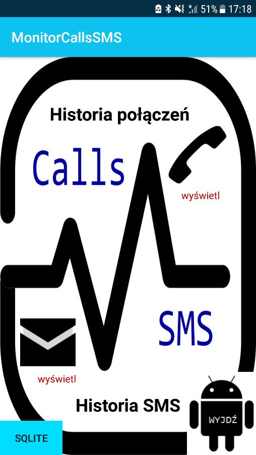
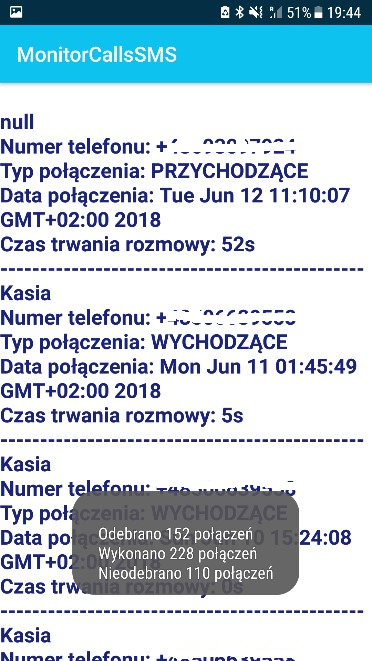
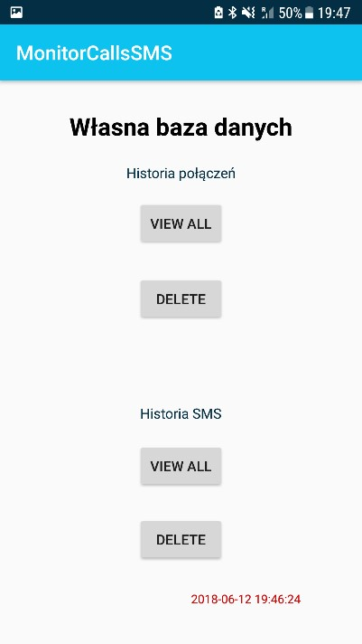
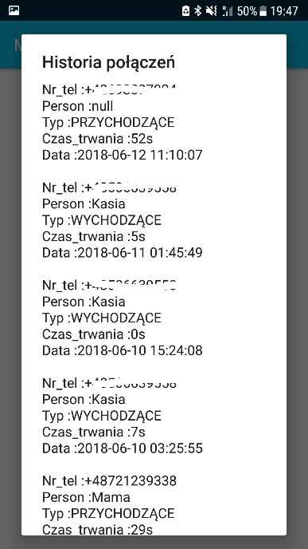
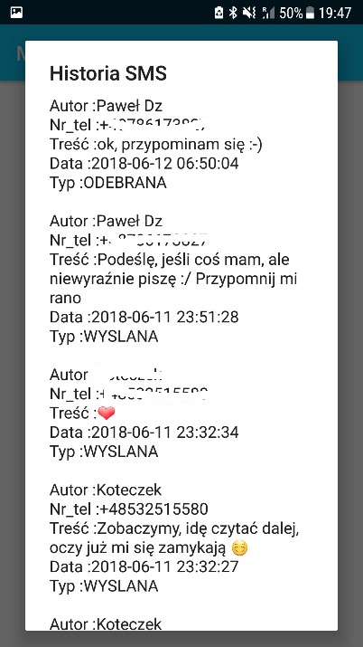

# MonitorCallsSMS
Monitorowanie statystyk połączeń i smsów, zapis informacji do bazy danych SQLite.

## Ogólne informacje
Celem projektu było napisanie programu odpowiedzialnego za monitorowanie czasu rozmów i wysłanych wiadomości przez telefon komórkowy. 
W tym celu napisano aplikację mobilną na system Android zgodną od wersji Android 4.4 (Kitkat) – API 19 ( minimum SDK). 
Działanie aplikacji testowano na fizycznym urządzeniu: Samsung Galaxy A5 2016 z system Android 7.0 Nougat (API 24). 
Było to możliwe dzięki włączeniu opcji programistycznych w ustawieniach systemu oraz zaznaczenia opcji debugowanie USB. 
Skorzystano z wewnętrznej bazy danych systemu do monitorowania rozmów i smsów a także utworzono własną bazę danych SQLite w celu przechowywania informacji. 
Aplikacja przechowuje statystyki dotyczące rozmów: osobą dzwoniącą, numer telefonu, typ połączenia, szczegółową datę połączenia oraz czas rozmowy. 
Jeśli chodzi o statystyki dotyczące historii smsów otrzymujemy informację o autorze wiadomości, numerze telefonu, treści wiadomości, szczegółowej dacie oraz typie wiadomości.
Zawartość bazy danych można w każdej chwili usunąć.

## Technologie
* Android SDK
* SQLite

